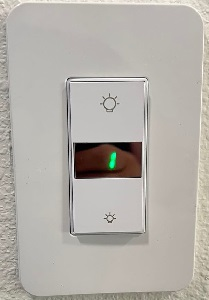

---
title: Milfra smart dimmer switch
date-published: 2024-5-10
type: dimmer
standard: global
board: bk72xx
difficulty: 4
---



## Overall description

Milfra dimmers are another type of in-wall, brightness-only light dimming devices with Tuya-Smart application support,
and support 3+ way installations.

## Technical details

The device is using Tuya-compatible application structure with two main components:

- application-specific MCU, responsible for controlling light output, and
- a Tuya CBU module that contains application level logic.
  - external switch input GPIO is connected to secondary MCU,
  - communication to dimming MCU is bidirectional, currently haven't determined what data the MCU is requesting from Tuya that causes an
    unknown command 0x34 error

## Programming

First programming was done over USB-serial. The module needs disassembled (pretty easy) and moderate soldering
skills are required to attach USB-RS232 converter cables.  Did not test if CloudCutter or other methods would work.

Need to solder cables Rx, Tx, Gnd, Vcc (3V3) and CEN pin.
Preferred flashing software is [ltchiptool](https://github.com/libretiny-eu/ltchiptool) from LibreTiny project. Start programming like:

```bash
ltchiptool flash write <firmware.uf2>
```

then short CEN pin to ground for a moment to initiate progrmming mode on the module.

## GPIO Pinout

| Pin    | Function                   |
|--------|----------------------------|
| GPIO10 | UART RX                    |
| GPIO11 | UART TX                    |

## Basic configuration

```yaml
substitutions:
  device_name: dimmer1
  icon: "mdi:light-switch"
  update_interval_wifi: "60s"

esphome:
  name: ${device_name}
  friendly_name: dimmer1

bk72xx:
  board: cbu

# Enable logging
logger:

# Enable Home Assistant API
api:
  encryption:
    key: "ZvtLZQmdkst8hIkkoF3To1Vq8uj6vzUsHyMDzNnVibY="

ota:
  password: "a4c4e4995aac6d0e47448c7f97924ba8"

wifi:
  ssid: !secret wifi_ssid
  password: !secret wifi_password

  # Enable fallback hotspot (captive portal) in case wifi connection fails
  ap:
    ssid: "dimmer1"
    password: !secret wifi_password
  use_address: xxx.xxx.xxx.xxx

captive_portal:

sensor:
  - platform: uptime
    name: Uptime

uart:
  rx_pin: GPIO10
  tx_pin: GPIO11
  baud_rate: 115200

tuya:

light:
  - platform: tuya
    name: dimmer
    dimmer_datapoint: 2
    min_value_datapoint: 3
    switch_datapoint: 1
    min_value: 200
    max_value: 1000


select:
  - platform: tuya
    enum_datapoint: 13
    name: Work Mode
    optimistic: true
    options:
      0: Light_White
  - platform: tuya
    enum_datapoint: 14
    name: Relay Status
    optimistic: true
    options:
      0: "Off"
      1: "On"
      2: Memory

text_sensor:
  - platform: wifi_info
    ip_address:
      name: "IP"
      icon: "mdi:ip-outline"
      update_interval:  ${update_interval_wifi}
    ssid:
      name: "SSID"
      icon: "mdi:wifi-settings"
      update_interval:  ${update_interval_wifi}
    bssid:
      name: "BSSID"
      icon: "mdi:wifi-settings"
      update_interval:  ${update_interval_wifi}
    mac_address:
      name: "MAC"
      icon: "mdi:network-outline"
    scan_results:
      name: "Wifi Scan"
      icon: "mdi:wifi-refresh"
      update_interval:  ${update_interval_wifi}
      disabled_by_default: true
  - platform: libretiny
    version:
      name: LibreTiny Version
    
```
